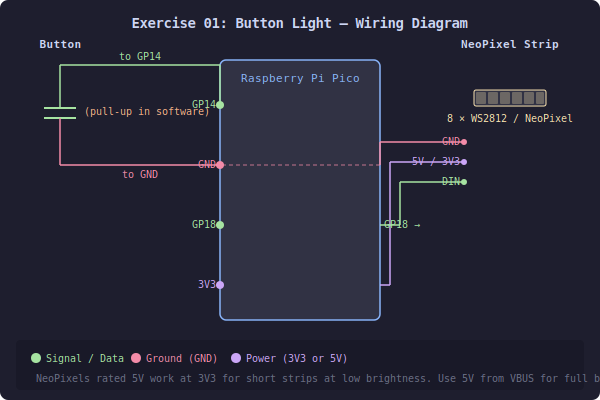

# Exercise 01: Button Light

## What You Will Build

A strip of NeoPixel LEDs that light up when you press a button and go off when you release it.

That is the complete brief. By the end of this exercise you will have built it — not by copying a solution, but by assembling it from parts you understand.

## What You Will Learn

- What the Connected Little Box (CLB) framework is and why it is structured the way it is
- What a *manager* is and how its lifecycle works
- How a device is configured using JSON settings
- What an *application* is and how it differs from a hardware driver
- How managers communicate through *services* and *events*
- How to assemble multiple managers into a working application

## Hardware Required

- A Raspberry Pi Pico (or compatible RP2040 board)
- A strip of at least 8 NeoPixel (WS2812) LEDs connected to GPIO pin 18
- A tactile push button connected between GPIO pin 14 and GND (the pin has a software pull-up, so no external resistor is needed)
- USB connection to a computer with a Chrome or Edge browser



---

# Part 1: The Framework

## What is the Connected Little Box?

The CLB is a MicroPython framework for building small connected devices. Its central idea is that **every capability of the device is implemented as a manager** — a self-contained Python class responsible for one thing. The WiFi connection is a manager. The NeoPixel strip is a manager. The button is a manager. Your application logic is also a manager.

These managers run cooperatively. There is no operating system, no threads, and no interrupts doing heavy work. Instead, every manager gets a turn in a tight loop:

```
while True:
    for each manager:
        manager.update()
```

This means **every `update()` must return quickly** — typically in under a millisecond. If one manager blocks, the whole device freezes. You will see how to handle time-consuming behaviour later using Python's `yield`.

## The Manager Lifecycle

Every manager goes through the same sequence of calls:

```
setup(settings)        ← called once at boot, initialise hardware
setup_services()       ← called after all managers are set up,
                          connect to other managers here
update()               ← called every loop, do ongoing work here
teardown()             ← called on shutdown (optional)
```

`setup()` is where you initialise hardware and read your settings.  
`setup_services()` is where you connect to other managers — subscribe to their events, get handles to their services.  
`update()` must be fast. Use `yield` if you need to wait.

## The Settings System

Every manager stores its configuration in a central file called `settings.json` on the device. A typical entry looks like this:

```json
{
    "indicator": {
        "enabled": true,
        "pixelpin": 18,
        "count": 8,
        "pixeltype": "RGB"
    },
    "gpio": {
        "enabled": true,
        "input_pins": [{"name": "button", "pin": 14}]
    }
}
```

Each top-level key is a manager name. If `"enabled"` is `true`, CLB loads that manager at boot. If it is `false` or the key is absent entirely, the manager is not loaded at all.

Managers declare their own default settings as a class attribute. When CLB loads `settings.json`, it merges the stored values with the defaults — any key that is missing from the file is filled in from the defaults automatically.

You can change a setting live from the REPL without editing any file:

```copy
set indicator.count=16
```

The change is saved to `settings.json` immediately and survives reboot.

## Applications vs Device Managers

There are two kinds of manager:

**Device managers** handle one piece of hardware or one system service. The indicator manager drives the NeoPixel strip. The GPIO manager watches input pins. Each lives in a file like `indicator_manager.py` and uses `CLBDeviceManager` as its base class.

**Application managers** define a complete working device configuration. They declare — in a single class attribute called `app_default_settings` — the full `settings.json` template: every device manager the application needs, with all their settings, plus the application's own configuration. They use `CLBAppManager` as their base class and live in files starting with `App_`.

Think of `app_default_settings` as the **bill of materials** for a specific device. Loading an application writes that bill of materials to `settings.json` and reboots. From that point, CLB loads exactly the managers that application needs and nothing else.

You switch between applications with a single REPL command:

```
select-app
```

This lists all registered applications and asks you to choose one by name.
