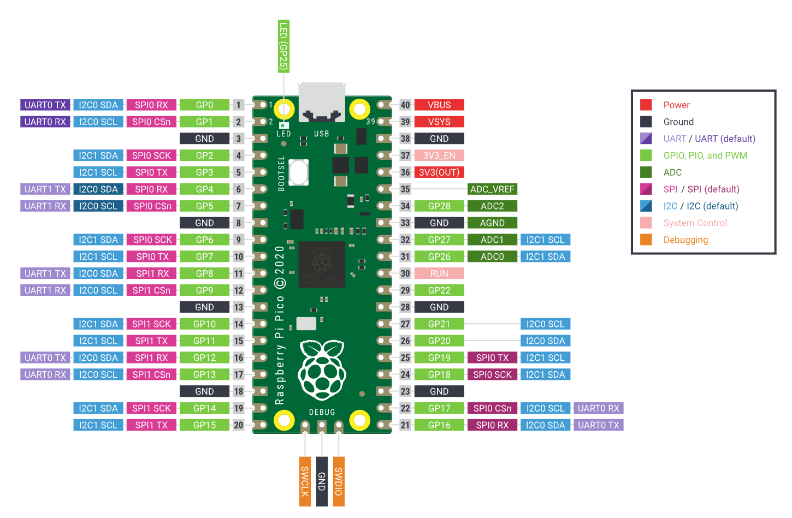
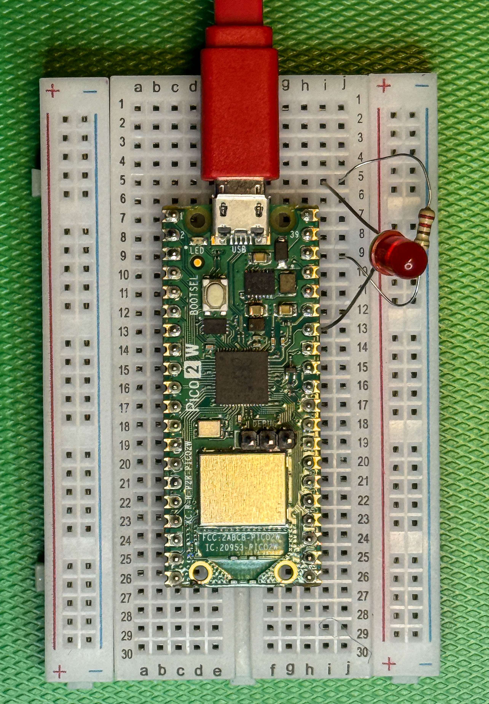

# Lab 2: LED Control

Now we'll move the LED from the constant 3.3 V supply to a **GPIO pin**, so a Python program running in the device can turn it on and off.

We're not going to write the program in this exercise though, we are going to type Python statements into the command prompt which will be performed by the device and control the led. You can think of this as a "stepping stone" to writing a program. But before we do this, we need to learn some hardware terms, starting with **GPIO**.

---

## What is GPIO?

GPIO stands for **General Purpose Input/Output**. These are pins that a program can control: set them HIGH (3.3 V) to switch something on, or LOW (0 V) to switch it off. The Pico has 26 usable GPIO pins, labelled GP0 to GP28 on the board.

> **Important:** When you use `machine.Pin(28, ...)`, the number 28 refers to **GP28** — the GPIO number — not the physical pin number on the board. GP28 happens to be physical pin 34. We are using it because it is easy to move the LED from the 3.3V supply to this pin. We could use any of the GPIO pins for this.



*Diagram: The Raspberry Pi Pico pinout. GPIO numbers (GP0, GP1 … GP28) label each signal pin; physical pin numbers run 1–40 around the outside. GP28 is on the left edge, physical pin 34.*

---

## Update the circuit

Unplug the PICO from your computer and move the resistor from the 3V3 pin (physical pin 36) to **GP28 (physical pin 34)**. Everything else stays the same. Plug the PICO back on when you have finished. 
```
Pico GP28 (pin 34) ── resistor ── LED anode (+) ── LED cathode (−) ── GND
```

The LED will not now be lit because GP28 is presently set as an input (which is how all GPIO pins are configured when a PICO starts) and so it is not producing a voltage. We will use a GPIO pin as an input later in this course. 




*Photo: Same breadboard as Lab 1, but the led now connects to GP28 (physical pin 34) instead of the 3V3 pin.*
